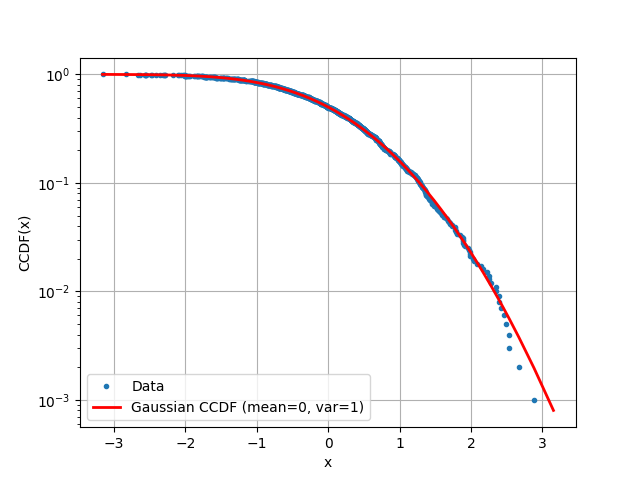

# CCDF サンプル

このリポジトリは、**経験的 CCDF (Complementary Cumulative Distribution Function)** と  
**理論的 CCDF (標準正規分布, 平均0・分散1)** を重ねて表示するサンプルです。



## セットアップ方法

仮想環境の作成と必要なライブラリのインストール

```bash
python3 -m venv .venv
source .venv/bin/activate
python3 -m pip install numpy matplotlib scipy
```

## 実行方法

```bash
python ccdf_sample.py
```

実行すると、経験的 CCDF と標準正規分布の理論的 CCDF がプロットされます。

## ライセンス

このリポジトリは [MIT License](./LICENSE)のもとで公開されています。